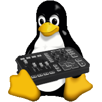

# GoXLR on Linux


[](https://discord.gg/Wbp3UxkX2j)




## About
This project is all about getting the GoXLR (and GoXLR mini) working properly on Linux. 
The [GoXLR-Utility](https://github.com/GoXLR-on-Linux/GoXLR-Utility) is used to configure the GoXLR and works also on other Unix systems such as macOS.
The main focus is on the last bits of the effects and the sampler now.
After that we will focus on a GUI application to get a better user experience,
also for users who have just switched to linux. The changeover should be as simple as possible.


###
#### Checkout our [history](https://github.com/GoXLR-on-Linux/.github/tree/main/history)


### Disclaimer
```
This project is not in any way affiliated with TC-Helicon. 
There is no official support for GoXLR (Mini) on Linux. 
This project, or any of its contributors cannot be held responsible 
for any issues you experience with your device, 
before or after using the scripts or documentation provided.
```
